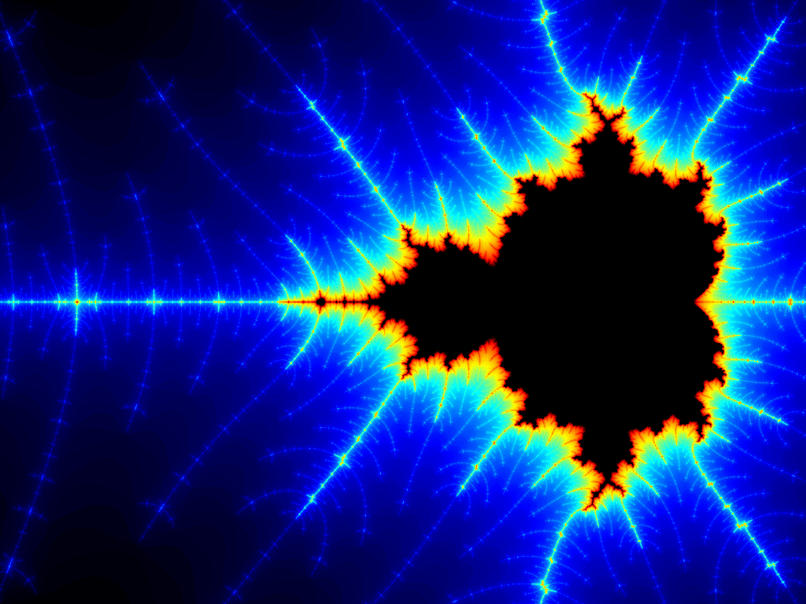
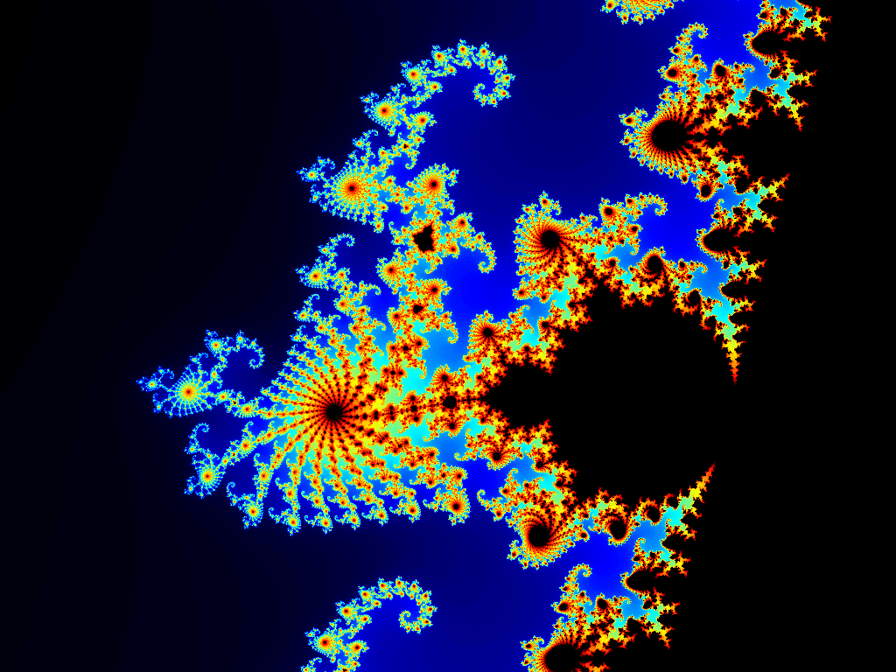
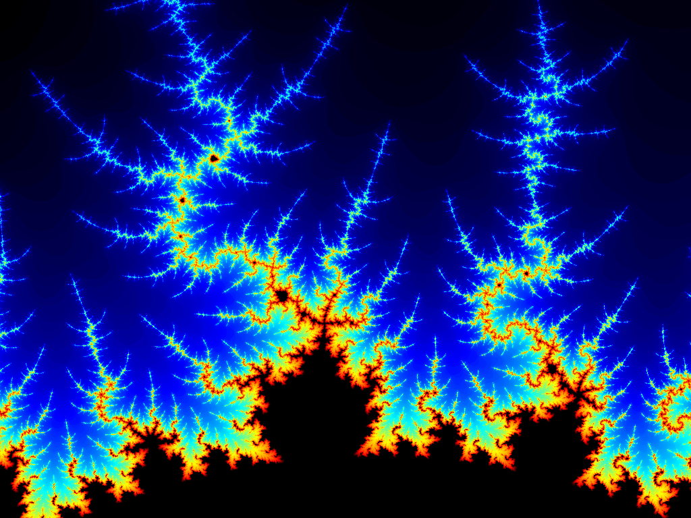
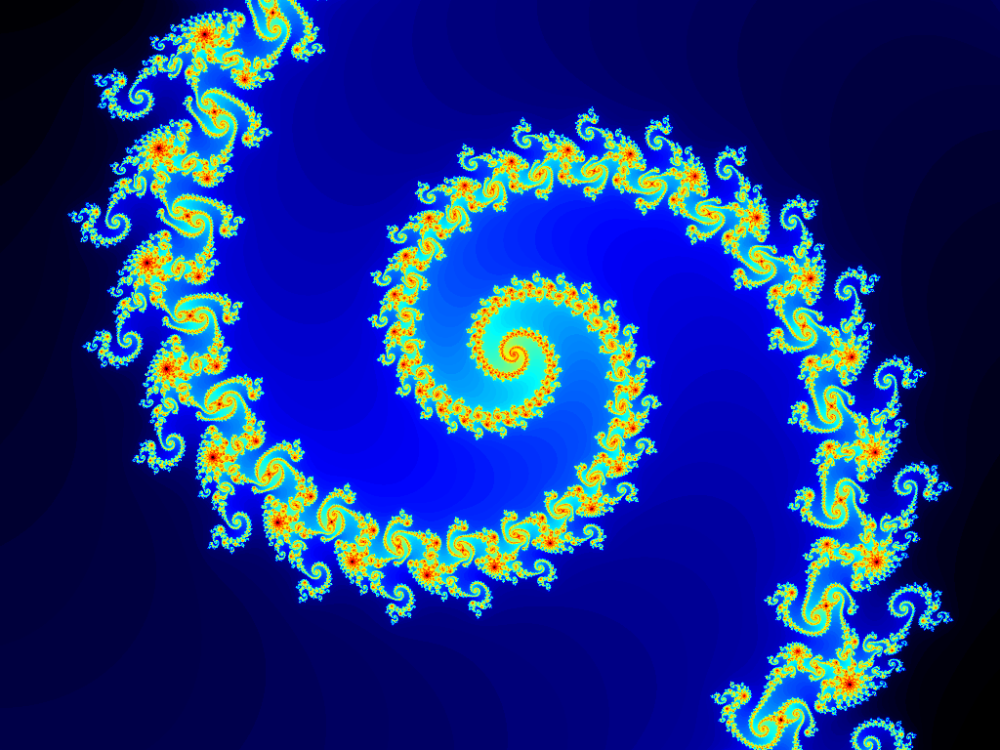
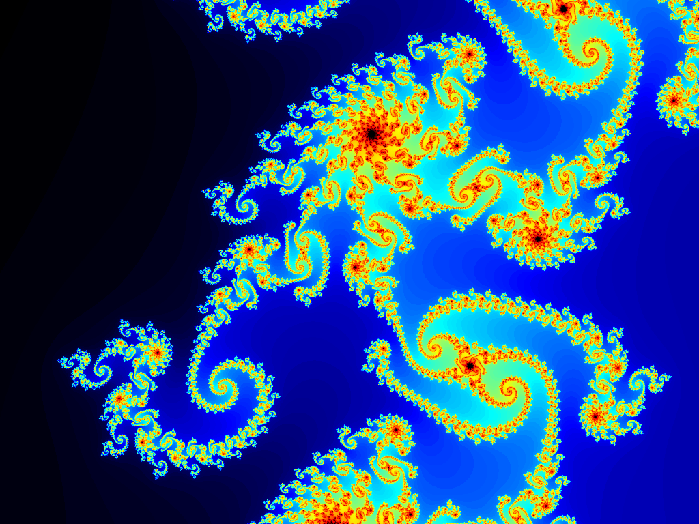
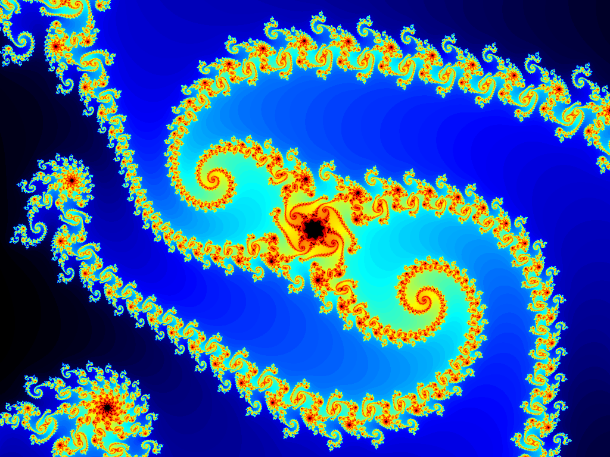
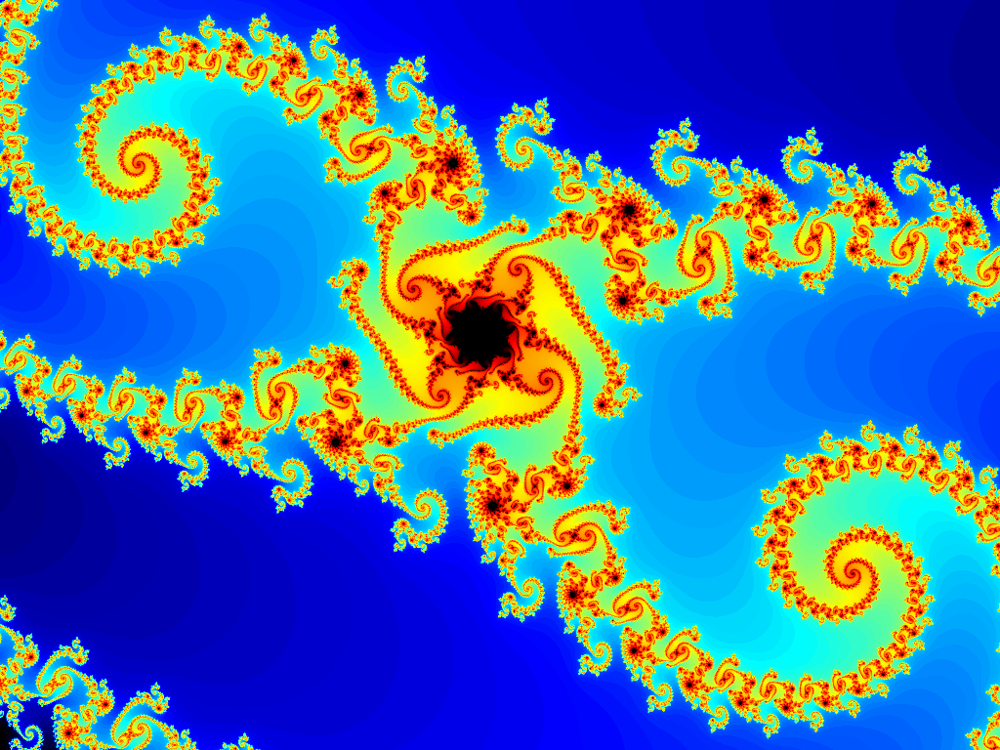
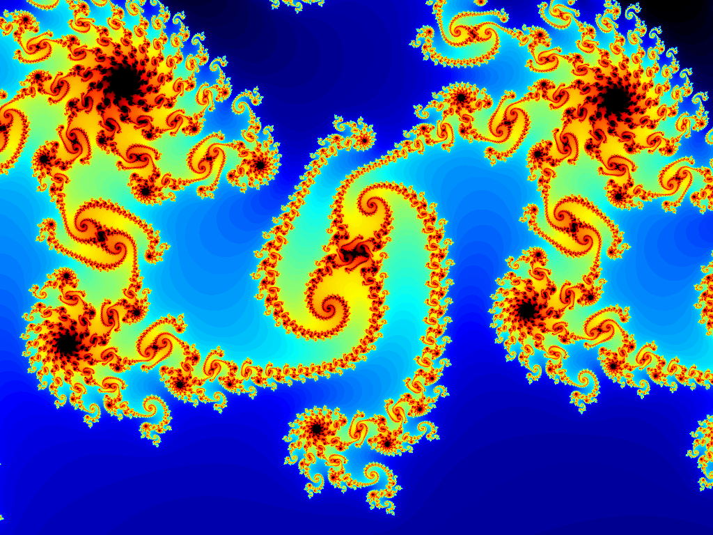
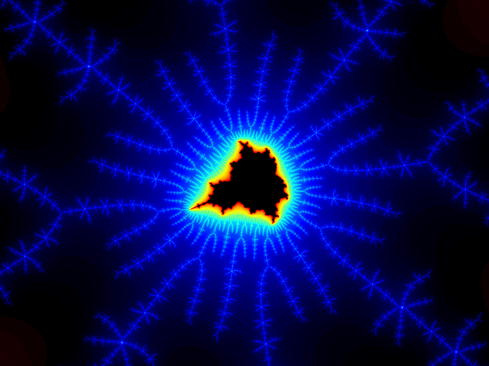

# Mandelbrot Set Renderer


An interactive Mandelbrot set explorer for DOS, rendered in 256-color VESA SVGA mode (up to 1024x768). Features smooth iteration coloring, supersampling anti-aliasing, interactive zoom, and post-processing color normalization.

Written in C/C++ for DOS. Compiled with Borland Turbo C++ 3.1, targeting 16-bit x86 real mode with the large memory model. Runs in DOSBox.



|||
|:---:|:---:|
|||
|||
|||
|||

## Features

- Escape-time Mandelbrot set rendering with 255 maximum iterations.
- VESA SVGA output at 640x400, 640x480, 800x600, or 1024x768 (256 colors).
- Smooth iteration coloring using the normalized iteration count formula to eliminate color banding at iteration boundaries.
- Supersampling anti-aliasing (2x2 through 5x5) for spatial noise reduction in high-detail regions.
- Interactive zoom box overlay with keyboard-driven positioning, resizing, and 4:3 aspect ratio lock.
- Post-processing color normalization that remaps rendered indices to span the full palette range (1-254), maximizing contrast in deeply zoomed views.
- Customizable fractal palette gradient defined as RGB control vectors in `CONFIG.INI`. Any number of control points (2-16) can be specified; palette indices are computed automatically by evenly spacing them across the palette range. Default gradient: Black, Blue, Cyan, Green, Yellow, Red, Magenta, Black.
- Screenshot saving in Autodesk Animator CEL format with auto-incrementing filenames.
- INI-based configuration for resolution, rendering options, palette gradient, and UI color.
- Direct pixel rendering to VESA video memory (no intermediate framebuffer).

## Mathematics

### The Mandelbrot Set

The Mandelbrot set $\mathcal{M}$ is the set of all complex numbers $c \in \mathbb{C}$ for which the orbit of $z = 0$ under the quadratic iteration

$$z_{n+1} = z_n^2 + c, \quad z_0 = 0$$

remains bounded as $n \to \infty$. Equivalently,

$$\mathcal{M} = \left\{ c \in \mathbb{C} \;\middle|\; \limsup_{n \to \infty} |z_n| < \infty \right\}$$

### Complex Arithmetic

Each iteration computes $z^2 + c$ by decomposing the complex numbers into real and imaginary parts. Given $z = a + bi$ and $c = c_r + c_i \, i$, the recurrence expands as:

$$z^2 + c = (a + bi)^2 + (c_r + c_i \, i) = (a^2 - b^2 + c_r) + (2ab + c_i) \, i$$

yielding the component-wise update rules used by the renderer:

$$a' = a^2 - b^2 + c_r$$

$$b' = 2ab + c_i$$

### Escape-Time Algorithm

For points outside the Mandelbrot set, the sequence $\{z_n\}$ diverges to infinity. The escape radius theorem guarantees that if $|z_n|^2 > R^2$ for any $n$, then $|z_n| \to \infty$. This program uses $R^2 = 4$, the theoretical minimum.

For each pixel, the algorithm iterates until either the escape condition is met or the maximum iteration count is reached:

$$n(c) = \min\left\{ n \in \mathbb{N} \;\middle|\; |z_n|^2 > 4 \right\}, \quad 0 \le n \le N_{\max}$$

where $N_{\max} = 255$. Points that never escape ($n = N_{\max}$) are classified as belonging to $\mathcal{M}$ and rendered in black (palette index 0).

### Screen-to-Complex-Plane Mapping

Each pixel $(p_x, p_y)$ on screen maps to a unique point $c \in \mathbb{C}$ via a linear transformation from pixel coordinates to the complex plane viewport $[x_{\min}, x_{\max}] \times [y_{\min}, y_{\max}]$:

$$c_r = x_{\min} + p_x \cdot \Delta_x, \quad c_i = y_{\min} + p_y \cdot \Delta_y$$

where the per-pixel scale factors are:

$$\Delta_x = \frac{x_{\max} - x_{\min}}{W}, \quad \Delta_y = \frac{y_{\max} - y_{\min}}{H}$$

and $W \times H$ is the screen resolution. The initial viewport is $[-2.5, 1.5] \times [-1.5, 1.5]$.

### Zoom Viewport Mapping

When the user selects a zoom region via the on-screen zoom box at pixel coordinates $(b_x, b_y)$ with dimensions $b_w \times b_h$, the new viewport is computed by mapping the box corners back to the complex plane:

$$x'_{\min} = x_{\min} + b_x \cdot \Delta_x, \quad x'_{\max} = x_{\min} + (b_x + b_w) \cdot \Delta_x$$

$$y'_{\min} = y_{\min} + b_y \cdot \Delta_y, \quad y'_{\max} = y_{\min} + (b_y + b_h) \cdot \Delta_y$$

The zoom box maintains a fixed $4\mathbin{:}3$ aspect ratio to match the display.

### Smooth Iteration Count (Normalized Iteration Count)

The discrete escape-time algorithm produces integer iteration counts, which create visible color banding at iteration boundaries. The normalized iteration count formula produces a continuous real-valued estimate $\mu$ that eliminates this banding.

For a point that escapes at iteration $n$ with final squared magnitude $|z_n|^2$, the smooth value is:

$$\mu = n + 1 - \frac{\log\!\left(\log |z_n|\right)}{\log 2}$$

Since the code stores $|z_n|^2$ rather than $|z_n|$, it uses the algebraically equivalent form:

$$\mu = n + 1 - \frac{\log\!\left(\tfrac{1}{2} \log |z_n|^2\right)}{\log 2}$$

This works because $\log|z_n| = \tfrac{1}{2}\log|z_n|^2$. The formula is derived from the asymptotic growth rate of the orbit: for large $|z|$, the iteration $z \mapsto z^2 + c$ approximately doubles $\log|z|$ at each step, so the fractional number of iterations needed to reach a reference escape radius can be interpolated logarithmically.

Points inside the set ($n = N_{\max}$) return $\mu = -1$, which callers treat as a sentinel for the set interior.

### Color Mapping

#### Discrete Color Mapping

The integer iteration count is mapped to a palette index using modular arithmetic:

$$\text{color}(n) = (n \bmod 254) + 1$$

This wraps the iteration count cyclically through palette indices $1$-$254$, with index $0$ reserved for the set interior.

#### Smooth Color Mapping

The continuous smooth value $\mu$ is mapped to a palette index analogously:

$$\text{color}(\mu) = \left(\lfloor \mu \bmod 254 \rfloor\right) + 1$$

where $\bmod$ denotes the floating-point modulus. This produces a smoothly varying color that transitions continuously across iteration boundaries.

### Supersampling Anti-Aliasing

For each pixel, an $N \times N$ grid of sub-samples (where $N \in \{2, 3, 4, 5\}$) is evaluated at uniformly spaced positions within the pixel's complex-plane footprint. The sub-sample positions are:

$$c_{s_x, s_y} = \left( x_{\min} + \left(p_x + \frac{s_x + 0.5}{N}\right) \Delta_x \right) + \left( y_{\min} + \left(p_y + \frac{s_y + 0.5}{N}\right) \Delta_y \right) i$$

for $s_x, s_y \in \{0, 1, \ldots, N-1\}$. Each sub-sample produces a smooth iteration value $\mu_k$. The final color for the pixel is the average over all escaped sub-samples:

$$\bar{\mu} = \frac{1}{|\mathcal{E}|} \sum_{k \in \mathcal{E}} \mu_k$$

where $\mathcal{E} \subseteq \{0, \ldots, N^2 - 1\}$ is the subset of sub-samples that escaped (i.e., $\mu_k \ge 0$). If $\mathcal{E} = \varnothing$, all sub-samples are interior points and the pixel is colored black. This averaging reduces spatial aliasing artifacts in high-frequency detail regions of the fractal.

### Post-Processing Color Normalization

After rendering, the color normalization pass remaps the fractal palette indices in video memory so they span the full range $[1, 254]$, maximizing visual contrast.

Because the renderer uses modular arithmetic, a narrow band of iteration counts can wrap around the palette and produce a split distribution. For example, iterations $240$-$268$ map to indices $\{241, 242, \ldots, 254, 1, 2, \ldots, 15\}$, occupying both ends of the palette with a large unused gap between them.

The algorithm operates in two passes:

**Pass 1 -- Circular Band Detection.** A histogram records which palette indices $[1, 254]$ are present in the rendered image. The algorithm then walks the circular index range to find the largest contiguous gap of unused indices. The occupied band is the complement of this gap, with band start $b_0$ defined as the first used index after the gap. This correctly handles distributions that wrap around from index $254$ back to index $1$.

**Pass 2 -- Linear Remapping.** Each used palette index is assigned an ordinal rank $k \in \{0, 1, \ldots, K-1\}$ based on its position in the circular walk from $b_0$, where $K$ is the total number of distinct used indices. The new palette index is computed as:

$$c' = 1 + \left\lfloor \frac{k \cdot 253}{K - 1} \right\rfloor$$

This linearly stretches the $K$ used indices to fill the full range $[1, 254]$. Interior pixels (index $0$) and UI overlay pixels (index $255$) are left unchanged.

### Palette Gradient Interpolation

The 254-entry fractal palette is constructed by linearly interpolating between $M$ user-defined control vectors $\mathbf{v}_0, \mathbf{v}_1, \ldots, \mathbf{v}_{M-1}$, where each $\mathbf{v}_j = (R_j, G_j, B_j)$ is an RGB triplet in VGA DAC format ($0$-$63$ per channel).

The control vectors are evenly spaced across palette indices $1$-$254$:

$$i_j = 1 + \left\lfloor \frac{j \cdot 253}{M - 1} \right\rfloor, \quad j = 0, 1, \ldots, M-1$$

For each palette index $i$ in segment $[i_j, i_{j+1}]$, the color is interpolated channel-wise:

$$R(i) = R_j + \frac{(R_{j+1} - R_j)(i - i_j)}{i_{j+1} - i_j}$$

and analogously for $G(i)$ and $B(i)$. The default gradient uses eight control vectors forming a cyclic path through color space: Black $\to$ Blue $\to$ Cyan $\to$ Green $\to$ Yellow $\to$ Red $\to$ Magenta $\to$ Black.

## Quick Start

The pre-compiled `FRACTAL.EXE` is included in the [latest release](https://github.com/rohingosling/Fractal-Renderer-DOS/releases/latest). It is a 16-bit DOS executable and requires [DOSBox](https://www.dosbox.com/) or a compatible DOS emulator to run.

### 1. Download

Download `FRACTAL.EXE` and `CONFIG.INI` from the [latest release](https://github.com/rohingosling/Fractal-Renderer-DOS/releases/latest) and place them in the same folder.

### 2. Run in DOSBox

```
mount c c:\path\to\your\folder
c:
fractal
```

The Mandelbrot set will begin rendering immediately. Press **ESC** to exit.

### 3. Explore

- Press **Tab** to show the zoom box, use the **arrow keys** to position it, and press **Enter** to zoom in.
- Press **A** to toggle smooth coloring, or **2**-**5** to increase the supersampling level.
- Press **S** to save a screenshot.

### Alternative DOS Emulators

Any DOS-compatible emulator that supports VESA VBE 1.2 SVGA graphics will work, including [DOSBox-X](https://dosbox-x.com/) and [86Box](https://86box.net/). Mount the directory containing `FRACTAL.EXE` and `CONFIG.INI`, then run `FRACTAL`.

### Custom Configuration

To use a different configuration file:

```
fractal -config "path\settings.ini"
```

### Interactive Controls

| Key | Action |
|-----|--------|
| `Tab` | Toggle zoom box |
| Arrow keys | Move zoom box |
| `=` / `-` | Resize zoom box (4:3 aspect ratio) |
| `Enter` | Zoom into selected region |
| `A` | Toggle smooth iteration coloring |
| `0`-`5` | Set supersampling level (0 = off, 2-5 = NxN grid) |
| `S` | Save screenshot (CEL format). Use Desktop Animator to view `.CEL` files. |
| `Esc` | Exit (or abort render in progress) |

## Building from Source

Building requires **Borland Turbo C++ 3.1** (`BCC.EXE`) running inside DOSBox. The compiler is a 16-bit DOS program and cannot run on a modern OS directly.

### Prerequisites

- [DOSBox](https://www.dosbox.com/) (or [DOSBox-X](https://dosbox-x.com/))
- [Borland Turbo C++ 3.1](https://en.wikipedia.org/wiki/Turbo_C%2B%2B) installed and accessible from within DOSBox

### Build Steps

1. Mount both the Borland compiler directory and the project source directory in DOSBox:
   ```
   mount c c:\path\to\borland
   mount d d:\path\to\fractal-source
   set PATH=%PATH%;C:\BIN
   d:
   ```
2. Run the build script:
   ```
   build
   ```
   This compiles `VESA.C` (C with inline assembly), `INI.CPP`, `APP.CPP`, and `MAIN.CPP` (C++), then links them into `FRACTAL.EXE`. All output is logged to `BUILD.LOG`.
3. Run the program:
   ```
   fractal
   ```

### Compiler Flags

| Flag  | Purpose                                                                 |
|-------|-------------------------------------------------------------------------|
| `-ml` | Large memory model (required for far pointers and `farmalloc`)          |
| `-2`  | Enable 80286+ instructions                                             |

### Build Notes

- All source filenames follow the DOS 8.3 naming convention.
- `clean.bat` removes build artifacts (`.OBJ`, `.EXE`, and `BUILD.LOG`).
- Floating-point emulation is included automatically by the compiler when math functions are used.

## Project Structure

```
FRACTAL2/
├─ main.cpp      Entry point, parses -config flag, creates Application
├─ app.h         Application class declaration, constants, key definitions
├─ app.cpp       All rendering, zoom, palette, and file I/O logic
├─ ini.h         INI file parser class declaration
├─ ini.cpp       INI file parser implementation (sections, key-value pairs)
├─ vesa.h        VESA SVGA graphics library header (C-callable)
├─ vesa.c        VESA SVGA library (C with inline x86 assembly)
├─ CONFIG.INI    Runtime configuration (resolution, rendering, UI color)
├─ build.bat     Build script for BCC
├─ clean.bat     Removes build artifacts
├─ run.bat       Launches FRACTAL.EXE with debug flags│
└─ images/       Rendered fractal screenshots (CEL and PNG)
```

## Technical Details

### Rendering Pipeline

Pixels are rendered directly to VESA video memory via `PutPixel()` at segment `A000h`. The VESA library handles 64 KB bank switching transparently. No intermediate image buffer is used -- pixel values are read back from video memory via `GetPixel()` during post-processing and file save operations.

### Smooth Iteration Coloring

Smooth coloring applies the normalized iteration count formula to produce continuous real-valued color indices that eliminate the hard banding visible with integer iteration counts. See [Smooth Iteration Count](#smooth-iteration-count-normalized-iteration-count) in the Mathematics section for the derivation.

### Supersampling Anti-Aliasing

For each pixel, an NxN grid of sub-samples is evaluated at evenly spaced offsets within the pixel's complex-plane footprint. The smooth iteration values of all escaped sub-samples are averaged to produce the final color index. See [Supersampling Anti-Aliasing](#supersampling-anti-aliasing) in the Mathematics section for the sampling geometry.

### Color Normalization

After rendering, a two-pass normalization algorithm detects the circular band of used palette indices and linearly remaps them to span the full range (1-254), maximizing contrast in deeply zoomed views. See [Post-Processing Color Normalization](#post-processing-color-normalization) in the Mathematics section for the remapping formula.

### Palette Design

The 256-entry palette is partitioned as follows:

| Index | Purpose |
|-------|---------|
| 0 | Mandelbrot set interior (black) |
| 1-254 | Fractal escape-time colors (seven-ramp gradient) |
| 255 | UI overlay color (zoom box, scanline indicator) |

The fractal gradient follows eight control vectors: Black &rarr; Blue &rarr; Cyan &rarr; Green &rarr; Yellow &rarr; Red &rarr; Magenta &rarr; Black, linearly interpolated across indices 1-254.

### VESA Graphics Library

Low-level SVGA graphics in C with inline x86 assembly. Supports VESA VBE 1.2 mode setting, pixel read/write with automatic 64 KB bank switching, rectangle fill and outline, BIOS ROM font text rendering, VGA DAC palette upload, and vertical retrace synchronization.

### Target Hardware

- CPU: Intel 80286+ (16-bit real mode, no FPU required -- software float emulation)
- Video: VESA VBE 1.2 compatible SVGA adapter
- Memory: Conventional DOS memory (large model, far-heap allocation)

## Configuration

All settings are in the `[Settings]` section of `CONFIG.INI`:

| Key | Values | Description |
|-----|--------|-------------|
| `width` / `height` | 640x400, 640x480, 800x600, 1024x768 | VESA screen resolution |
| `antialiasing` | 0, 1 | Smooth iteration coloring (toggle with `A` at runtime) |
| `supersampling` | 0, 2, 3, 4, 5 | NxN supersampling grid size (set with `0`-`5` at runtime) |
| `normalize_color_range` | 0, 1 | Post-processing color normalization |
| `image_path` | path string | Screenshot save directory |
| `ui_red` / `ui_green` / `ui_blue` | 0-63 | UI overlay color (VGA DAC format) |
| `debug` | 0, 1 | Show palette test display |
| `palette_control_vector_0` ... `_N` | `R,G,B` | Gradient control vectors (VGA DAC, 0-63 per channel) |

Control vectors are numbered sequentially (`palette_control_vector_0`, `palette_control_vector_1`, ...). Palette indices are computed automatically by evenly spacing them across 1-254. Minimum 2 required. Scanning stops at the first missing key; if fewer than 2 are found, the built-in default gradient is used.

## License

This project is shared for educational and archival purposes.
